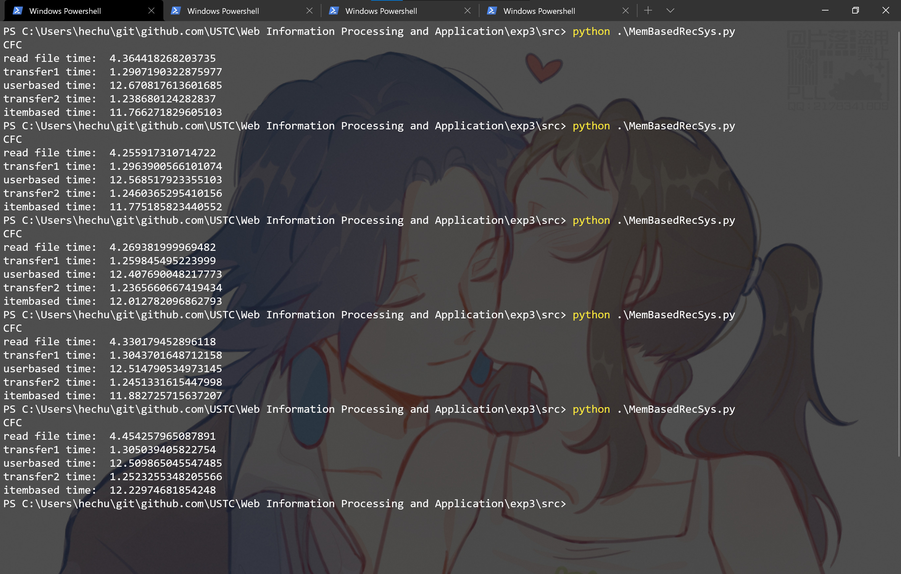
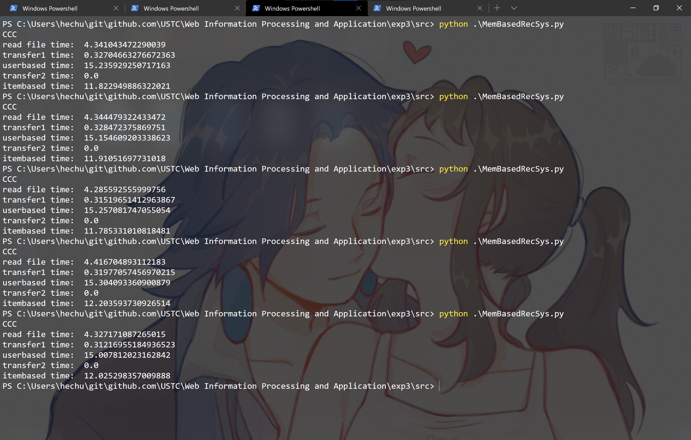
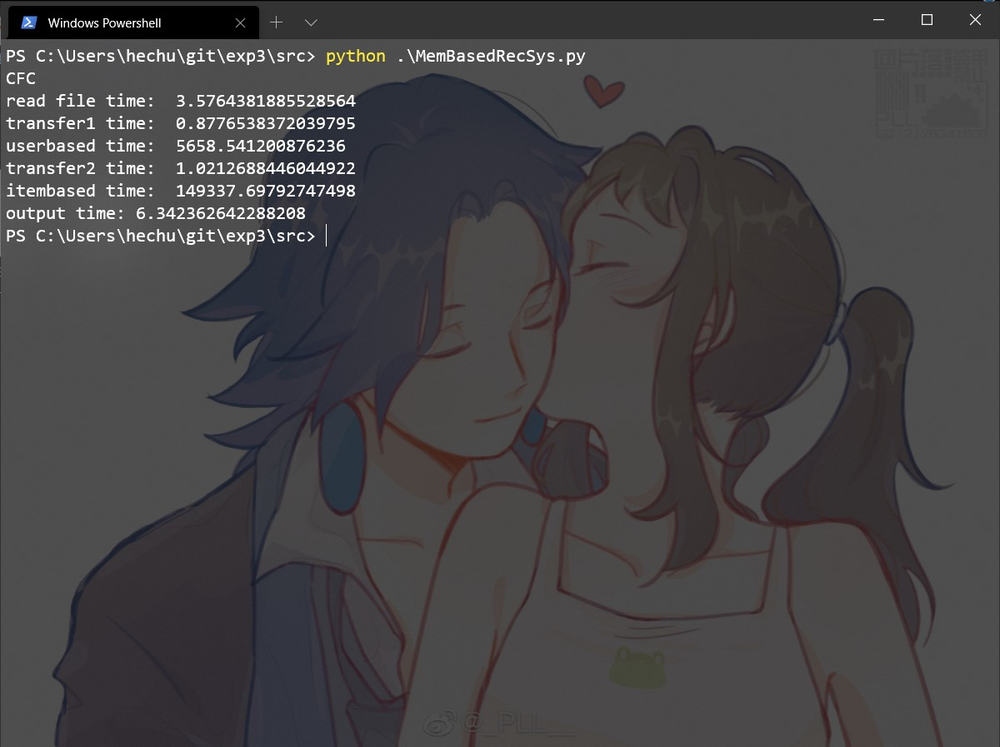
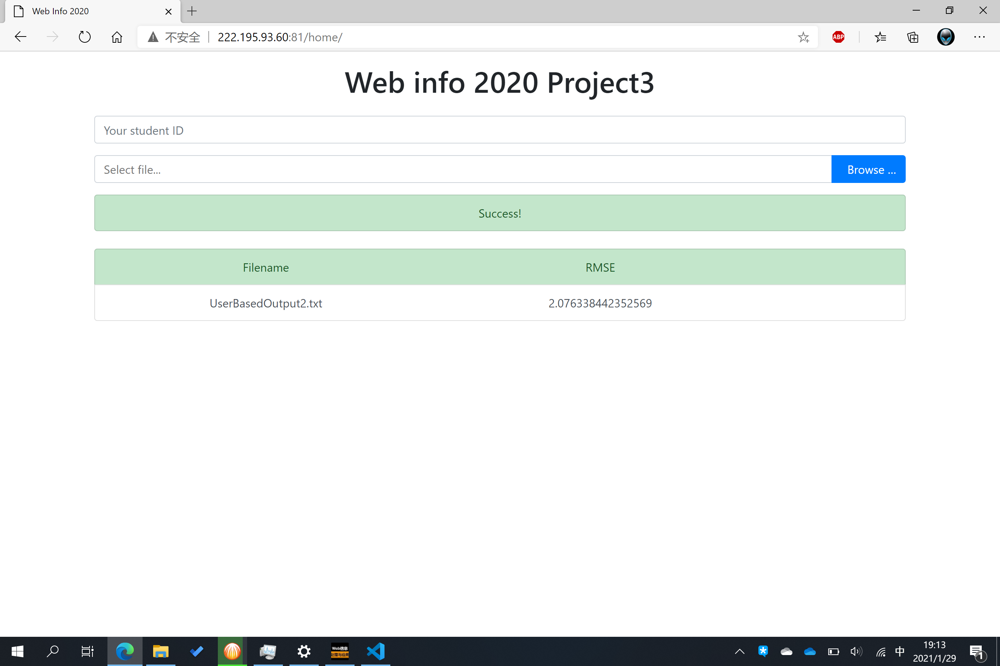
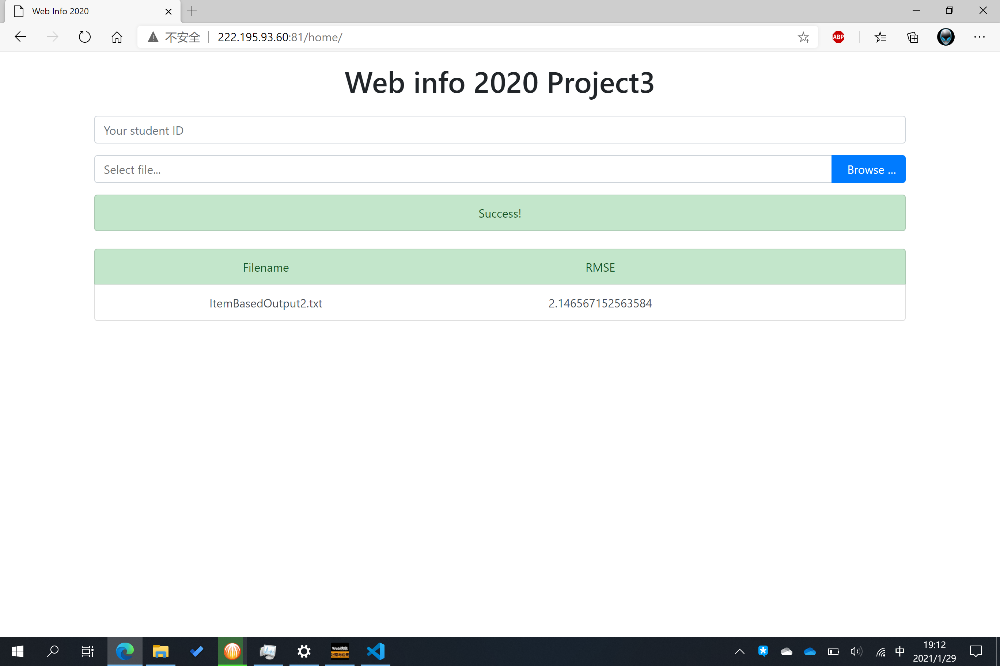
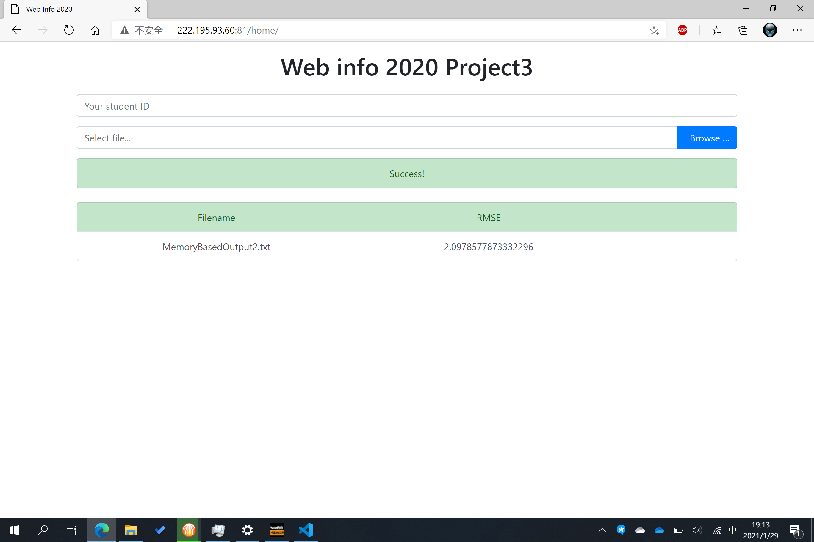

## 
 Web信息处理与应用 实验报告 

### 
 lab3 

### 团队成员
- 何春望 PB17000075
- 吴健宗 PB17000082

### 实验内容
本实验数据来源为豆瓣电影的评分记录。要求根据训练数据中的用户评分信息，判断用户偏好，并为测试数据中 user-item 对进行评分，并基于 RSME 指标进行结果苹果。（可选）可以自行使用 NLP 技术进行标签处理或社交网络分析技术进行社交推荐。

### 算法描述
代码采用了基于内存的协同过滤推荐系统。读入数据时，将训练数据转化为一个稀疏矩阵，表示各个用户对不同电影的评分。此时列向量即为用户画像，行向量为物品画像。在测试集进行预测时，计算选定的用户（电影）与其他用户（电影）向量的余弦相似度并进行排序，选出前k个正相关且有效的评分，按相似度加权计算加权平均数得到预测的评分。最后将浮点数转化为整数即可输出。

由于使用基于用户的推荐方法，和基于物品的推荐方法原理相似，但得到的预测结果并不一定相同，因此我们同时实现了这两种推荐算法，并通过一个全局的权重系数来对这两个预测结果进行平均，以方便选择一个合适的平衡点。选取的k个近邻数量同样可以通过全局变量方便地调节。

### 优化内容
#### *时间-空间*的平衡
经过统计我们发现，数据集中共有2185名用户和74683部电影。若先计算并存储所有 vector-vector 之间的余弦相似度，可以估算存储全部用户相关性矩阵需要$2185×2185×float64=36.4MB$内存，存储全部电影的相关性矩阵需要$74683×74683×float64=41.5GB$内存。故存储全部相关性矩阵是不现实的做法。

而如果每项任务临时计算所需要的相关性向量，已知测试集共$932994$项任务，每秒完成5个预测仍需52小时（这大约是第一次试运行基于推荐时观测到的print输出频率）。

由此可见，在这场时间和空间的博弈中，两种极端方法的代价都有些难以接受。对此我们的解决方法是，每次只存储相关性矩阵的一部分而不是全部，以求在合理的空间占用中节约计算量和计算时间。

注意到相关性矩阵是一个对称矩阵，每一行代表一个用户（电影）与其他所有用户（电影）的相似度向量，因此每次只计算矩阵的一行的意义即为每次必须完成与该用户（电影）有关的所有预测任务。很容易想到，读取全部预测任务后按用户（电影）的ID顺序进行预测即可简单实现。但由于预测顺序与测试集的顺序并不相同，需要将预测任务-预测结果存储为字典键值对，输出时需要再次读取测试文件以确定输出顺序；也可在构造字典时就存储任务编号，输出前再按此项进行一次排序。

经统计，测试集中共需预测2173个不同用户和44222个不同电影的打分，若按ID顺序进行预测，不更换用户/电影时则无需重新计算相关性矩阵。此时，临时空间仅需$2185×float64=17KB$或$74683×float64=583KB$，相似度的计算量可以节约$932994/2173=429$倍和$932994/44222=21$倍。

#### 矩阵的*存储方式*
我们知道，矩阵是一种二维表示方式，但其在内存中是以一维的形式存储的，因此具有“行储优先”（`C_CONTIGUOUS`）和“列储优先”（`F_CONTIGUOUS`）两种存储方法。在本实验中，矩阵的行、列数分别达到了74683和2185。在如此大的矩阵中，不当的存储方式将导致内存交换代价变得十分可观。然而基于用户和基于物品的方法分别适合列储优先和行储优先的矩阵形式，两者天然互相矛盾。因此无论选用那种单一的形式，都将浪费无数时间。

好在`numpy.matrix`类型提供了简便的方法来改变矩阵的存储方式，而且对相同大小的矩阵来说转换的时间是`O(1)`的，因此在适当的时候提前改变存储方式就能省下大量时间。按照程序调用顺序，我们在构建初始矩阵、基于用户预测、基于物品预测三处分别选用行储优先和列储优先存储矩阵，仅进行 UserID=0,1 的预测任务，控制变量并进行多次对比测试，得到$8×5=40$组数据，运行效果如下：

可见，若存储方式相同，相同部分的（平均）计算时间就相同，而需要转换存储方式时的转换耗时大约固定为 1-1.5s；仅两组任务，在任意一部分省下的时间就已经能弥补转换耗时。故进行完整预测任务时的转换耗时可以忽略不计。

表现最优的存储方式为“CFC”，即行储优先进行数据读取、列储优先进行基于用户预测、行储优先进行基于物品预测。

### 实验结果
在以上优化完成后，进行完整的预测任务，最终时间消耗如下：

程序输出了两种方法单独的预测结果和加权平均后的预测结果，三种结果的RMSE指标分别为：

由于运行一次占用时间过长，没有尝试不同的权重系数。（电脑占着不能磕盐啊喂(╯‵□′)╯︵┻━┻）

### 总结
通过本次实验，掌握了基于协同过滤方法的推荐系统，并直观地了解到数据存储方式对程序运行时间的影响，以及对时间和空间的恰当权衡，受益匪浅。
